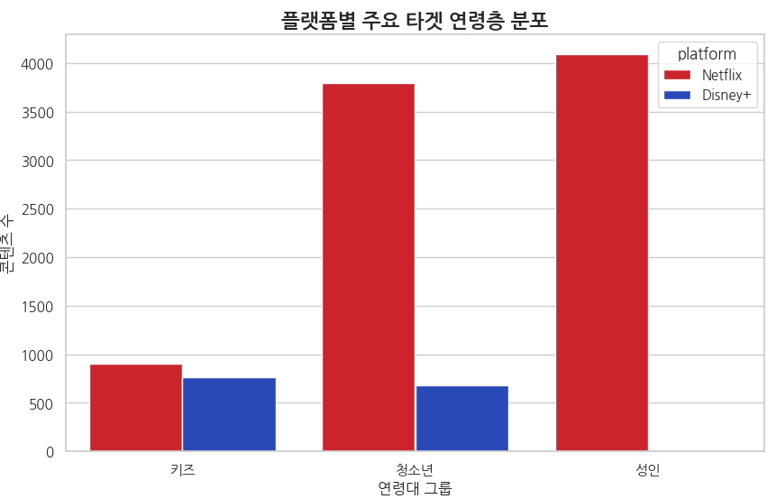
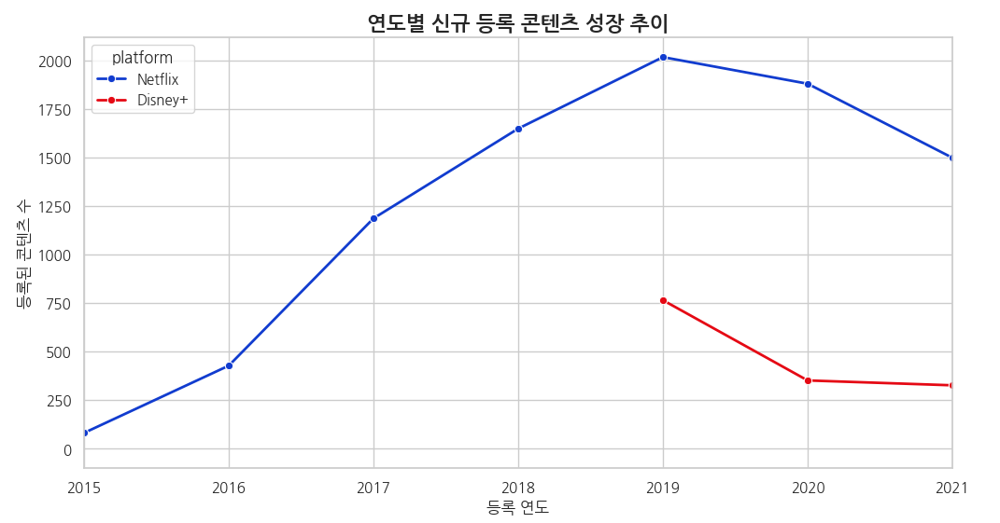
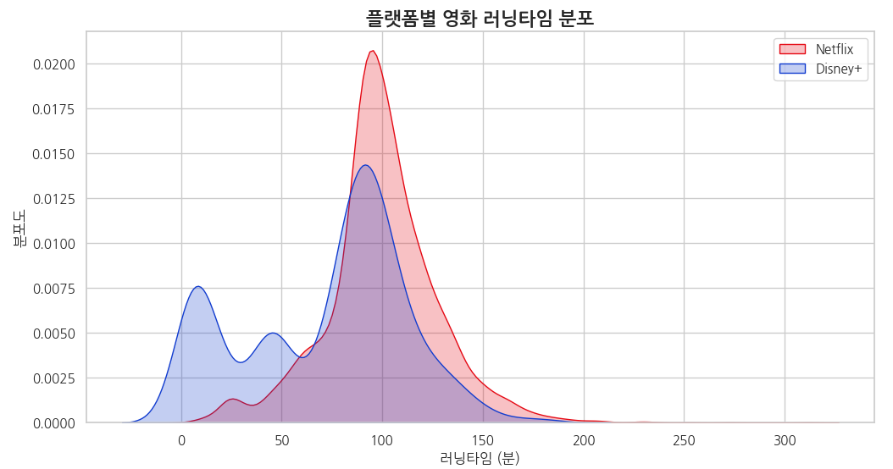

# 🎬 OTT 플랫폼 간 콘텐츠 구성 및 타겟 전략 비교 분석 프로젝트 (2025/12)

본 프로젝트는 글로벌 OTT 서비스인 **Netflix**와 **Disney+**의 데이터를 바탕으로 콘텐츠 구성, 타겟 연령층, 업로드 성장 추이 등을 분석하여 각 플랫폼의 시장 전략 차이를 정량적으로 입증한 데이터 분석 프로젝트입니다.

---

## 📌 1. 프로젝트 개요
- **주제**: 데이터 기반 OTT 플랫폼(넷플릭스, 디즈니+) 콘텐츠 라이브러리 비교 분석
- **배경**: 후발 주자인 디즈니 플러스가 넷플릭스가 독점하던 OTT 시장에서 어떤 차별화된 전략으로 콘텐츠를 구성하고 있는지 데이터를 통해 확인하고자 함.
- **분석 도구**: 
  - **Environment**: Google Colab (Python 3.10)
  - **Library**: Pandas, Numpy, Matplotlib, Seaborn
  - **Font**: NanumGothic (한글 시각화 설정 적용)

---

## 🛠️ 2. 데이터 수집 및 전처리 (Data Preprocessing)

데이터의 신뢰성을 높이기 위해 수집된 원천 데이터를 정제하는 과정을 상세히 수행했습니다.

### 2.1 데이터 병합 및 식별
- 두 플랫폼의 CSV 파일을 각각 로드한 후, 플랫폼 구분을 위한 `platform` 컬럼을 생성하였습니다.
- `pd.concat`을 사용하여 총 10,000개 이상의 레코드를 가진 통합 데이터프레임을 구축했습니다.

### 2.2 결측치(Missing Values) 처리
- **감독/배우/국가**: 정보가 누락된 경우(`NaN`) 데이터 분석 시 누락되지 않도록 `'Unknown'` 문자열로 일괄 대체하였습니다.
- **필수 데이터 정제**: 업로드 날짜(`date_added`)와 등급(`rating`)이 비어있는 행은 전체 데이터의 극소수이므로 통계적 정확도를 위해 삭제 처리하였습니다.

### 2.3 데이터 변환 (Transformation)
- **시계열 데이터**: 문자열이었던 `date_added`를 `datetime` 객체로 변환하고, `year_added`와 `month_added` 파생 변수를 생성하여 시계열 분석의 기반을 마련했습니다.
- **단위 정제**: 영화 러닝타임 데이터의 `' min'` 문자열을 제거하고 숫자형(`float`)으로 변환하여 수치 분석이 가능하도록 처리했습니다.

---

## 📊 3. 탐색적 데이터 분석 (EDA) 및 시각화

### 🎯 3.1 타겟 연령층 그룹화 분석 (Target Audience)
넷플릭스는 성인 콘텐츠, 디즈니 플러스는 키즈 콘텐츠에 특화되어 있음을 확인하였습니다.

> **인사이트**: 넷플릭스는 **성인(Adults)** 콘텐츠가 약 45%로 가장 큰 비중을 차지하지만, 디즈니 플러스는 **키즈(Kids)** 콘텐츠가 압도적으로 많아 브랜드 정체성이 데이터에 뚜렷하게 반영됨을 알 수 있습니다.

### 📈 3.2 연도별 콘텐츠 업로드 성장 추이
두 플랫폼의 연도별 신규 콘텐츠 등록 추이를 비교하였습니다.

> **인사이트**: 넷플릭스는 2016년 이후 자체 오리지널 콘텐츠 생산을 통해 급격한 우상향 곡선을 그리며 성장하였고, 디즈니 플러스는 서비스 런칭 시점에 기존 보유 IP(마블, 스타워즈 등)를 대량 등록하며 시장에 진입했습니다.

### ⏳ 3.3 영화 러닝타임 분포 분석 (KDE Plot)
플랫폼별 영화 콘텐츠의 평균적인 러닝타임 분포입니다.

> **인사이트**: 두 플랫폼 모두 90~100분 내외의 영화가 가장 많지만, 넷플릭스는 120분 이상의 장편 영화 비중이 디즈니 플러스보다 상대적으로 높게 나타납니다.

---

## 💡 4. 프로젝트 결론 및 기대효과

1. **전략적 차이 입증**: 넷플릭스는 '다양성과 양'을 강조하는 포괄적 플랫폼인 반면, 디즈니 플러스는 '특정 연령대(가족/아동)'를 타겟팅하는 전문화 전략을 사용하고 있음을 도출했습니다.
2. **비즈니스 인사이트**: 후발 주자의 경우, 넷플릭스와 정면 승부하기보다 특정 카테고리(키즈)의 경쟁력을 강화하는 것이 시장 안착의 핵심임을 데이터로 입증했습니다.
3. **기술적 성과**: 결측치 처리부터 파생 변수 생성, 그리고 Seaborn을 활용한 고급 시각화까지 데이터 분석의 전체 파이프라인을 성공적으로 구현했습니다.

---
